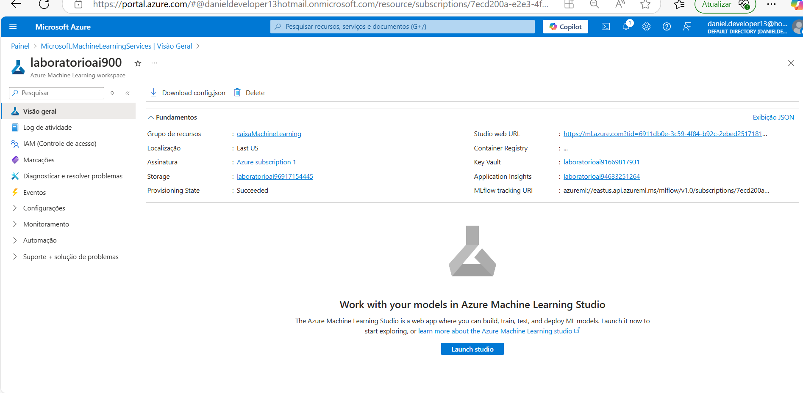

# Passo a passo da pratica Azure ML em 2 partes

## Parte 1 - No Portal do Microsoft Azure.

#### Passo 1: Ir ate o Painel Marketplace, clique em Azure machine Learning

#### Passo 2: Porta do Microsoft Azure crie o recurso para ser usado no IA do Azure estudio.

#### Passo 3: Criar um workspace no Azure ML com dados abaixo:

## Parte 2 - No Portal do Microsoft Azure.

#### Passo 1: coloque os dada referentes as configurações básicas

#### Passo 2: Escolha e adicione as configurações básicas

#### Passo 3: Selecionar tipo de tarefa para regressão e clicar em criar

#### Passo 4: Escolher um arquivo ou pasta para carregar e clique em avançar.

#### Passo 5: Dados carregados do arquivo baixado.

#### Passo 6: Ajustar configurações e depois avançar.

#### Passo 7: dados apresentados ao entrar

#### Passo 8: dados apresentados

#### Passo 9: Ao enviar um trabalho de ml automatizado faça os ajustes abaixo:

#### Passo 10: Metricas geradas:

#### Passo 11: Residuais Histogram

#### Passo 12: json com resultado:

